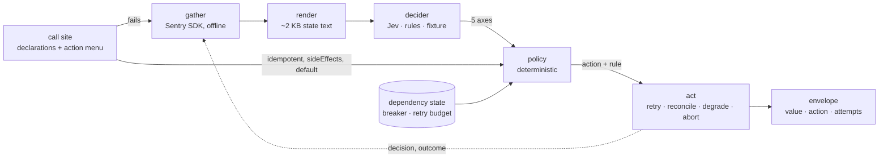

# rekurs

**Failure as a decision point.** Wrap a call once, declare a few facts about it and a menu of
recovery actions. When it fails, rekurs gathers context, classifies the fault, and a
deterministic policy picks the action. No per-error code at the call site.

> rekurs does not recurse: every retry charges a deadline and a per-dependency budget.

```js
import { rekurs, retry } from 'rekurs';

const { value, action } = await rekurs(
  (signal) => fetch('https://api.example.com/things', { signal }).then((r) => r.json()),
  {
    description: 'list things',
    dependency: 'example-api',
    idempotent: true,
    deadlineMs: 2_000,
    actions: { retry: retry({ max: 3 }), degrade: () => [] },   // abort is built in
  },
);
```

## How it works



**Perception vs policy.** The decider only perceives: it places the failure on five axes and
never sees the action menu. The policy is code: it combines the axes with the site's static
declarations and shared dependency state, picks one action, and names the rule that matched.
Hard gates (breaker open, budget exhausted, side effects with an unknown outcome) never depend
on a probability.

## The five fault axes

| Axis | Question | Values | Drives |
|---|---|---|---|
| **persistence** | Will the same call succeed if repeated soon? | transient · persistent · unknown | retry vs fail fast |
| **locus** | Where does the fault lie? | my_input · dependency · network · environment · unknown | fix request / wait / reroute / shed |
| **outcome** | Did the operation take effect? | did_not_happen · may_have_happened · happened | retry vs reconcile |
| **overload** | Is the failure caused by load? | probability 0–1 | back off + shed, never retry |
| **scope** | How widely does the failure reach? | this_call < this_dependency < everything | local remedy vs trip the breaker |

Each choice axis is `{ pick, p: { option: probability }, conf }`; overload is `{ p }`.
Low confidence falls through to the site's `default`.

## Deciders

| Decider | What it is | Use |
|---|---|---|
| `createRulesDecider()` | lookup table over error code + HTTP status | baseline, zero latency, default |
| `createJevDecider({ client })` | [Jev](https://docs.typesafe.ai), a non-generative classifier: Choice/Score/Noul in one ~70 ms call | `createJevHttpClient()` (reads `JEV_KEY`) or `createMockJevClient()` |
| `createFixtureDecider({ path })` | replay recorded decisions by fingerprint | tests, CI eval |
| `createGuardedDecider(inner)` | cache · single-flight · rate limit · breaker · timeout · sampling | wrap any decider before production |

When the decider is slow, down, or flooded, the guard throws and the policy falls closed to
the site's `default`. 20,000 failures against a stalled decider: ~400 ms, 40 inner calls.

## Declarations

| Field | Meaning |
|---|---|
| `description` | one line: what the operation does (Jev reads it) |
| `dependency` | key for shared breaker + retry budget |
| `idempotent` | retry safety is a code property, never inferred from text |
| `sideEffects` | unknown-outcome failures go to `reconcile`, never `retry` |
| `deadlineMs` | total budget; thin remaining budget skips the decider |
| `default` | action when the decider is unavailable or unsure (`abort` if omitted) |
| `actions` | the closed menu: handlers for `retry`, `reconcile`, `degrade`, … |

Result: `{ value, action, attempts, degraded }`, or a `RekursError` carrying the trail.

## Context gathering

`createSentryGather()` uses the Sentry Node SDK (optional dependency) with a transport that
never touches the network: one event per failing invocation, later attempts as breadcrumbs,
decisions and outcome joined back as tags, everything to a JSONL file that becomes fixtures.

```js
import { createRekurs, createSentryGather } from 'rekurs';

const sentry = await createSentryGather({ jsonlPath: '.rekurs/events.jsonl' });
const run = sentry.wrap(createRekurs({ gather: sentry.gather, onDecision: sentry.annotate }));
```

`renderState(context, site, ctx)` turns the event into the state text a decider reads:
exception → breadcrumbs (HTTP first) → attempts → operation → runtime → upstream body
(last, capped, labelled untrusted).

## Try it

```sh
npm install
npm run demo                  # 8 fault scenarios + a 500-call storm, one wrapped site each
npm run demo -- --decider=rules|mock-jev|fixture
npm run eval:jev              # the scenarios against the real Jev (JEV_KEY in .env)
npm run probe -- 503          # one scenario, full state text + every axis distribution
npm run probe -- --state=my-state.txt --site=getWork   # ask Jev about hand-written state
npm run demo:record           # regenerate test/fixtures/decisions.jsonl
npm test
```

The CI eval replays the fixtures against `demo/scenarios.js`; a label, threshold or preference
change that flips a decision fails the build.

## Status

Prototype. Design and open questions: `.kanbento/notes/design.md`. Node >= 20, plain ESM, no
build step, zero runtime dependencies (Sentry optional).
